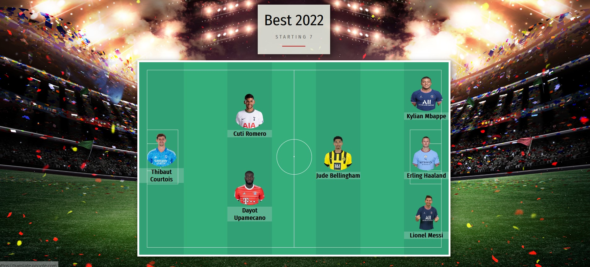

<!-- PROJECT LOGO -->
 

  

  <h2 align="center">Football 7: Team Generator</h2>
  <h4 align="center">Node.JS & Object Oriented Programming Project</h4>

---

            

  

  This project consists in a building a team generator, powered by Node.js, using Inquirer.js, the app will start with "node index.js" and ask the user some questions about the team. When the user answers and fills in the seven players, an interactive soccer field will be displayed, with the players in their position.
     
     
    <a href="https://github.com/RaulMaya/Team-Profile-Generator">Repository</a>    
    ·
    <a href="https://raulmaya.github.io/Team-Profile-Generator/dist/">Deployment</a>
    ·
    <a href="https://www.linkedin.com/in/raul-maya/">My LinkedIn</a>

  

<!-- ABOUT THE PROJECT -->

### About The Project

 

This project was created using tools such as JavaScript, Node.JS, Inquirer.JS, and Jest.JS, this last one for unit testing. Once the application start, the terminal will ask the user some questions about the team, and the user will answer them according to the team he want to fill. Once the user answer all the questions of the terminal, the application will generate an index file with the field as a background with all the players set according to their position.

### Video

 <video width="600" height="440" controls>
  <source src="https://www.youtube.com/watch?v=1oDECQxuNHI" type="video/mp4">
  <source src="https://www.youtube.com/watch?v=1oDECQxuNHI" type="video/ogg">
https://www.youtube.com/watch?v=1oDECQxuNHI
</video>

URL: https://www.youtube.com/watch?v=1oDECQxuNHI

### Setup

Clone this repo to your desktop and run `npm install` to install all the dependencies.

Check to be in the folders terminal, an then on the terminal run `node index.js`.

### License

> You can check out the full license [here](https://github.com/IgorAntun/node-chat/blob/master/LICENSE)
> This project is licensed under the terms of the **MIT** license.

### Contact :iphone:

- Name: Raul Maya Salazar
- Phone: +52 833 159 7006
- E-mail: raulmayas20@gmail.com
- GitHub: https://github.com/RaulMaya
- LinkedIn: https://www.linkedin.com/in/raul-maya/

(<a href="#top">back to top</a>)

